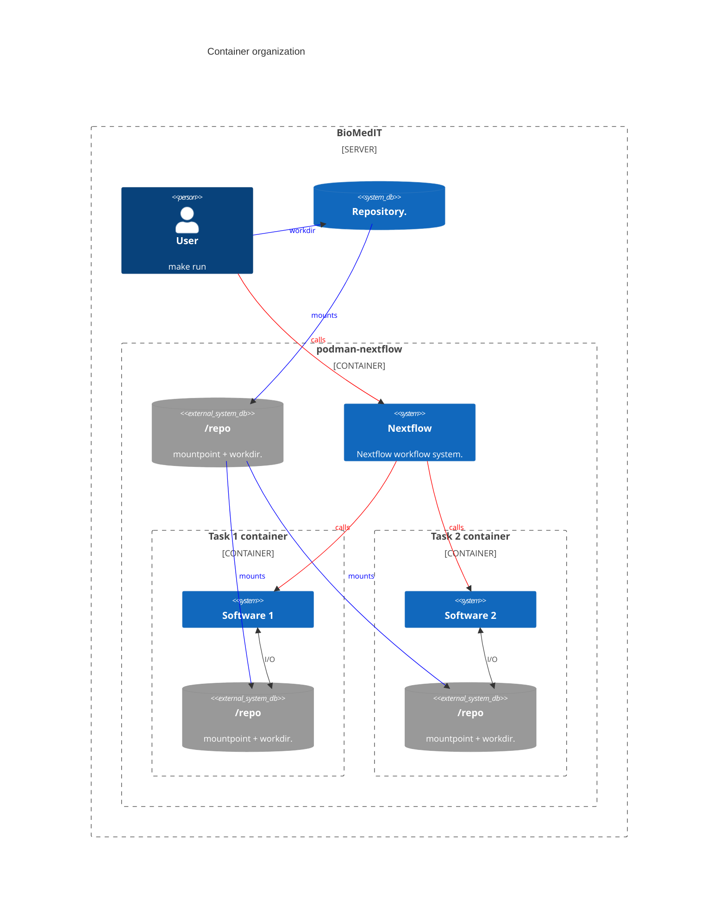

# Demo BioMedIT workflow

## Context

This repository showcases a containerized workflow to semantize synthetic patient data using the SPHN framework.
It is designed to run on biomedical systems with the following restrictions:

* No internet acccess besides a private container registry
* Only podman available
* No root access
* keep data provenance information separate from the git repository

## Containerization

The project is structured to run entirely inside podman with modular containers.
The main workflow uses Nextflow inside podman, and each workflow task uses podman-in-podman to run in its own (single-program) container.

The repository is mounted in the Nextflow container, and Nextflow is responsible for managing the containers and mounting the volume for each task.

## Workflow description

The workflow processes simulated patient data from synthea in JSON format and generates an RDF graph describing patient healthcare appointments (patient, dates and institution).

The data is semantized using the [SPHN ontology](https://www.biomedit.ch/rdf/sphn-ontology). Mapping rules are defined in human readable [YARRRML format](https://rml.io/yarrrml/) (see `data/mappings.yml`). The triples are materialized using containerized tools from [rml.io](https://rml.io).

The workflow definition can be found in [workflow/main.nf](workflow/main.nf) and its configuration in [workflow/nextflow.config](workflow/nextflow.config).

## Usage

Commands to interact with the workflow are written as Makefile rules (see the [Makefile](Makefile)):
* `make run`: Starts the nextflow container and runs the workflow inside.
* `make get_in`: Starts the nextflow container and opens an interactive shell inside.
* `make clean`: Deletes any previous instance of the container (named `wf-container`).