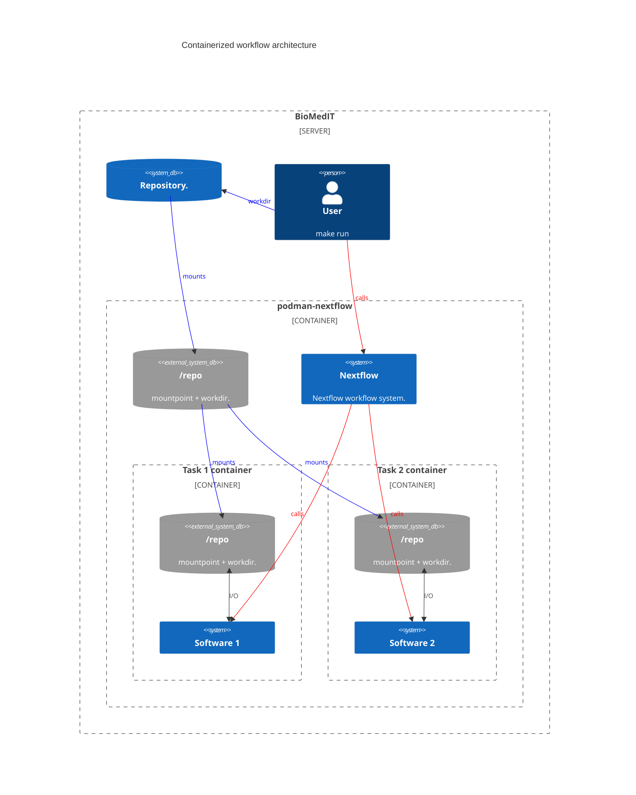
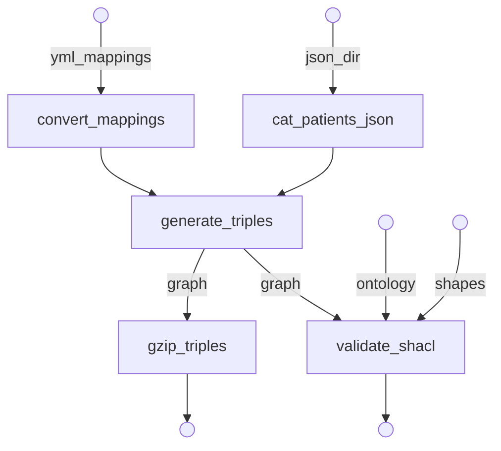

# Demo BioMedIT workflow

## Table of contents

* [Context](#context)
* [Containerized workflow](#containerized-workflow)
* [Workflow description](#workflow-description)
* [Usage](#usage)
* [License](#license)

## Context

This repository showcases a containerized workflow to semantize synthetic patient data using the SPHN framework.
It is designed to run on biomedical systems with the following restrictions:

* No internet acccess besides a private container registry
* Only podman available
* No root access
* keep data provenance information separate from the git repository

## Containerized workflow

The project is structured to run entirely inside podman with modular containers.
The main workflow uses Nextflow inside podman, and each workflow task uses podman-in-podman to run in its own (single-program) container.

The repository is mounted in the Nextflow container, and Nextflow is responsible for managing the containers and mounting the volume for each task. This modular layout, allows to easily reuse task containers across projects (as opposed to building a single container with nextflow and all dependencies for each project).




## Workflow description

The workflow processes simulated patient data from synthea in JSON format and generates an RDF graph describing patient healthcare appointments (patient, dates and institution). It then validates the resulting graph.

The data is semantized using the [SPHN ontology](https://www.biomedit.ch/rdf/sphn-ontology). Mapping rules are defined in human readable [YARRRML format](https://rml.io/yarrrml/) (see [data/mappings.yml](data/mappings.yml)). The triples are materialized using containerized tools from [rml.io](https://rml.io). The graph validation is done using [pySHACL](https://github.com/RDFLib/pySHACL) with the [SPHN shacl shapes](https://git.dcc.sib.swiss/sphn-semantic-framework/sphn-shacl-generator).

The workflow definition can be found in [main.nf](main.nf) and its configuration in [nextflow.config](nextflow.config).



## Usage

First clone the repository and move into the folder:

`git clone https://github.com/SDSC-ORD/demo_biomedit_workflow.git && cd demo_biomedit_workflow`

Commands to interact with the workflow are written as Makefile rules (see the [Makefile](Makefile)):
* `make prod-run`: Run the containerized workflow using the latest commit on the repository remote.
* `make dev-run`: Run the containerized workflow using the workflow file in the current directory.
* `make get_in`: Start the nextflow container and open an interactive shell inside.

The Makefile also contains command to manage podman images:
* `make push`: Build and pushe the workflow image to provided registry
* `make build`: Build the workflow image

All other rules are called automatically by those described above.

<details>
<summary><b>Run without cloning</b></summary>

Although it is recommended (and easier) to clone the repository, you could also run the workflow directly from the remote repository (assuming all required images are on the registry already).

The data files as well as `containers.yaml` need to be available. Params defined in the config can be overriden on the command line (e.g. `input_dir` below).

```sh
REGISTRY=example.registry.com/username/
REPO_URL=https://github.com/SDSC-ORD/demo_biomedit_workflow.git

podman run --privileged --rm -it -v $PWD:/repo -w /repo \
  ${REGISTRY}/podman-nextflow:tag \
  nextflow run ${REPO_URL} \
    -r main \
    --input_dir=data/test \
    -params-file containers.yaml \

# You can add --registry=${REGISTRY} to override URIs in containers.yaml
# and replace them with ${REGISTRY}/image-name:tag
```
</details>

## License

The code in this repository is licensed under [GPLv3](LICENSE).
The SPHN ontology and shapes files included in this repository are redistributed under the [Creative Commons Attribution-NonCommercial-ShareAlike 4.0 International (CC BY-NC-SA 4.0) license](https://creativecommons.org/licenses/by-nc-sa/4.0/). The SPHN ontology can be explored on the [BioMedIT website](https://www.biomedit.ch/rdf/sphn-ontology/sphn), and the shapes and ontology files were retrieved from the [SHACLer repository](https://git.dcc.sib.swiss/sphn-semantic-framework/sphn-shacl-generator).
