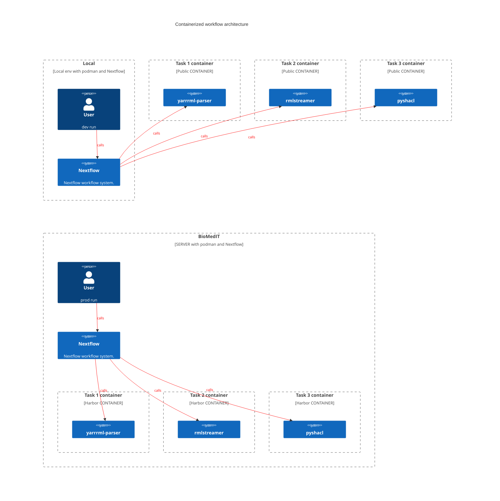
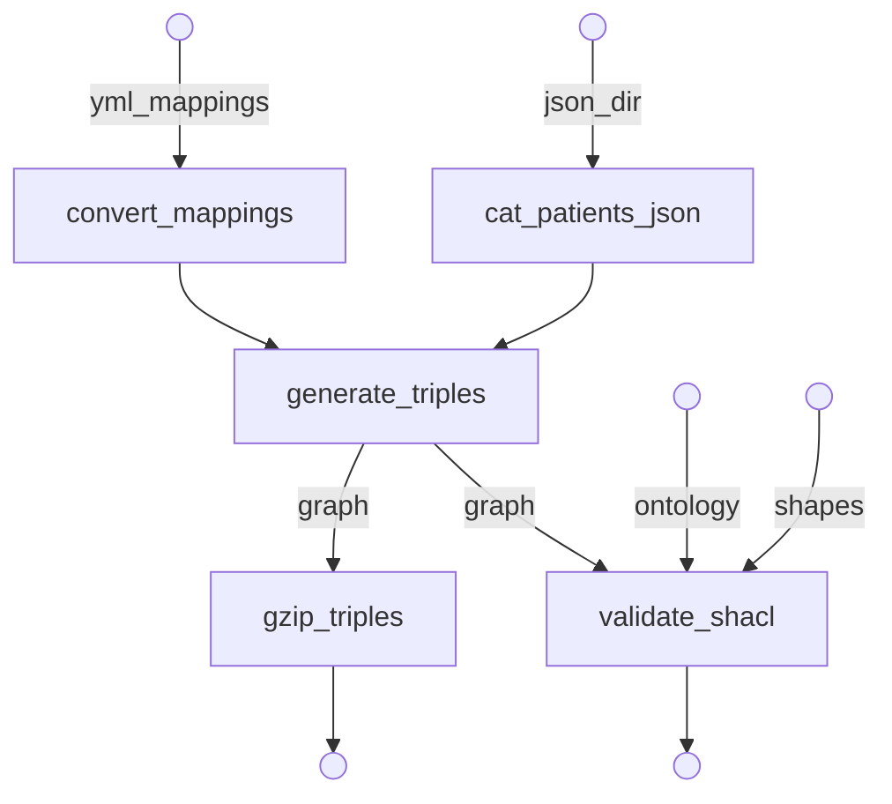

# Demo BioMedIT workflow

## Table of contents

* [Context](#context)
* [Containerized workflow](#containerized-workflow)
* [Workflow description](#workflow-description)
* [Usage](#usage)
* [License](#license)

## Context

This repository showcases a simple containerized workflow to semantize synthetic patient data using the SPHN framework.
It is designed to run on biomedical systems with the following restrictions:

* No internet acccess besides a private container registry
* Only `podman` and nextflow available
* No root access
* keep data provenance information separate from the git repository

## Containerized workflow

The project is structured to run individual tasks inside podman with modular containers. Nextflow is used as the workflow manager and event-based workflow executor.

## Workflow description

The workflow processes simulated patient data from synthea in JSON format and generates an RDF graph describing patient healthcare appointments (patient, dates and institution). It then validates the resulting graph. In addition to nextflow's native logging capabilities, the workflow produces an interoperable semantic `log` in JSON-LD format for traceability.

The data is semantized using the [SPHN ontology](https://www.biomedit.ch/rdf/sphn-ontology). Mapping rules are defined in human readable [YARRRML format](https://rml.io/yarrrml/) (see [data/mappings.yml](data/mappings.yml)). The triples are materialized using containerized tools from [rml.io](https://rml.io). The graph validation is done using [pySHACL](https://github.com/RDFLib/pySHACL) with the [SPHN shacl shapes](https://git.dcc.sib.swiss/sphn-semantic-framework/sphn-shacl-generator). An interoperable log is defined in `conf/log.conf` and is obtained by formatting [Nextflow's log](https://www.nextflow.io/docs/latest/tracing.html) using [JSON-LD](https://json-ld.org/) format.

The workflow definition can be found in [main.nf](main.nf) and its configuration in [nextflow.config](nextflow.config).

## Usage

First clone the repository and move into the folder:

`git clone https://github.com/SDSC-ORD/demo_biomedit_workflow.git && cd demo_biomedit_workflow`

### Profiles

To interact with the workflow for development or production, we use different [Nextflow profiles](https://www.nextflow.io/docs/latest/config.html#config-profiles) as follows:

* `nextflow run -profile standard main.nf`: Run the workflow using the workflow file in the current directory and publicly available containers defined in `conf/containers.yaml`. This is the default profile, and the `-profile` option can therefore be omitted.
* `nextflow run -profile prod main.nf`: Run the containerized workflow using the latest commit on the repository remote and containers from the private registry.

## Execution mode

By default, the workflow will be executed on each zip file present in the input directory.

When the option `--listen=true` is provided, the workflow manager will instead listen continuously for filesystem events and trigger execution whenever a new zip file appears in the input directory.

## License

The code in this repository is licensed under [GPLv3](LICENSE).
The SPHN ontology and shapes files included in this repository are redistributed under the [Creative Commons Attribution-NonCommercial-ShareAlike 4.0 International (CC BY-NC-SA 4.0) license](https://creativecommons.org/licenses/by-nc-sa/4.0/). The SPHN ontology can be explored on the [BioMedIT website](https://www.biomedit.ch/rdf/sphn-ontology/sphn), and the shapes and ontology files were retrieved from the [SHACLer repository](https://git.dcc.sib.swiss/sphn-semantic-framework/sphn-shacl-generator).
